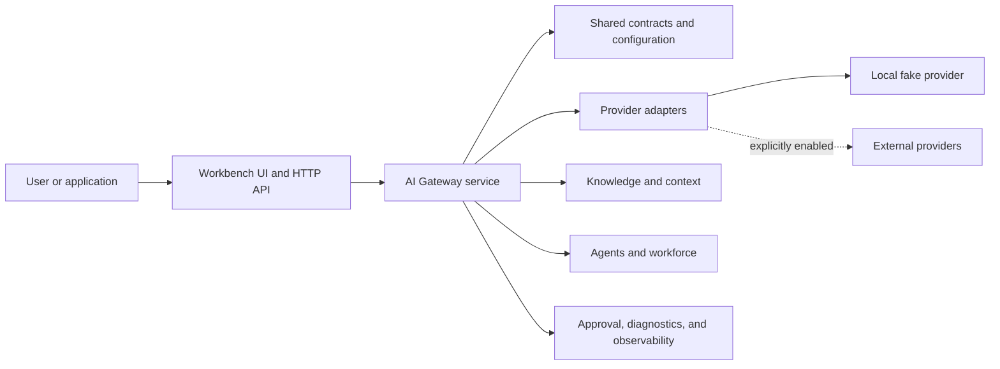

# Unified AI System

<p align="center">
  <strong>A local-first AI capability gateway for models, tools, agents, and governed automation.</strong>
  <br />
  面向模型、工具、智能体与可治理自动化的本地优先 AI 能力网关。
</p>

<p align="center">
  <a href="LICENSE">Apache-2.0</a> |
  <a href="docs/getting-started.md">Getting started</a> |
  <a href="docs/architecture.md">Architecture</a> |
  <a href="docs/providers.md">Providers</a> |
  <a href="CONTRIBUTING.md">Contributing</a>
</p>

## Current Status

| Question | Answer |
| --- | --- |
| Can anyone view and clone the repository? | Yes. The repository is public and licensed under Apache-2.0. |
| Can a fresh clone run without an API key? | Yes. The default local fake provider supports installation, health checks, UI access, and chat smoke tests. |
| Is there a hosted public API maintained by this repository? | No. Users run their own local or self-hosted instance. |
| Can users connect real model providers? | Yes, after supplying their own credentials and explicitly enabling a provider. |
| Is this production-ready, L5, or AGI? | No such claim is made. The current project is an open-source engineering workbench. |

## What It Provides

- A unified HTTP gateway for chat, streaming, routing, health, and diagnostics.
- A browser-based local Workbench at `/ui`.
- Provider adapters and explicit provider-selection controls.
- Agent, workforce, knowledge, context, and approval-oriented modules.
- Local-first defaults with real provider calls disabled until configured.
- Public-repository checks that reject secrets and regenerated phase archives.

## Quick Start

Requirements:

- Node.js 22 recommended; Node.js 20 or newer supported.
- pnpm 9.15.4 or newer.
- Git.

```bash
git clone https://github.com/happy520ai/unified-ai-system.git
cd unified-ai-system
corepack enable
corepack prepare pnpm@9.15.4 --activate
pnpm install --frozen-lockfile
pnpm verify:public-clone
pnpm start
```

Open:

- Workbench: [http://127.0.0.1:3100/ui](http://127.0.0.1:3100/ui)
- Health: [http://127.0.0.1:3100/health/check](http://127.0.0.1:3100/health/check)
- Setup readiness: [http://127.0.0.1:3100/setup/readiness](http://127.0.0.1:3100/setup/readiness)

The default configuration makes no external provider request.

## Call The Local Gateway

After starting the service:

```bash
curl --request POST http://127.0.0.1:3100/chat \
  --header "content-type: application/json" \
  --data "{\"prompt\":\"Hello from a public clone\"}"
```

This uses the local fake provider unless a real provider has been explicitly
configured. See [Provider setup](docs/providers.md) before enabling external
requests.

## Architecture



The service remains a modular monolith: one deployable gateway with internal
modules and reusable workspace packages. See
[Architecture](docs/architecture.md) for ownership boundaries.

## Repository Map

```text
apps/
  agent-console/          Operator-facing console
  ai-gateway-service/     Main gateway runtime and Workbench
packages/                 Shared contracts, SDKs, configuration, and engines
capabilities/             Capability manifests used by the local system
model-routing/            Routing policies and model metadata
local-self-use/           Local operating helpers
docs/                     Public user and architecture documentation
tools/                    Small, maintained repository checks
```

Historical phase documents, generated evidence, and one-off verifier scripts
are intentionally excluded from `master`. They remain available on the
`codex/archive-before-public-core-cleanup-20260730` branch.

## Public Commands

```bash
pnpm start                 # Start the local AI Gateway Workbench
pnpm check                 # Check every workspace package
pnpm test                  # Run maintained workspace tests
pnpm check:public          # Validate public-repository hygiene
pnpm verify:public-clone   # Start, probe, chat with, and stop the local gateway
```

## Real Providers

Real provider calls are disabled by default. Users must provide their own
credentials, select a provider, and opt into real execution. Never commit
credentials or real authorization inputs.

Start with [.env.example](.env.example) and
[Provider setup](docs/providers.md).

## Security

- Do not commit `.env`, API keys, tokens, webhooks, or private authorization
  records.
- Keep real provider calls explicit and budgeted.
- Report vulnerabilities through [SECURITY.md](SECURITY.md).
- Run `pnpm check:public` before every public contribution.

## Documentation

- [Documentation index](docs/README.md)
- [Getting started](docs/getting-started.md)
- [Architecture](docs/architecture.md)
- [Provider setup](docs/providers.md)
- [Troubleshooting](docs/troubleshooting.md)
- [Historical archive](docs/history.md)

## Contributing

Focused issues and pull requests are welcome. Please read
[CONTRIBUTING.md](CONTRIBUTING.md) and keep changes scoped, testable, and free
of secrets.

Licensed under [Apache-2.0](LICENSE).
