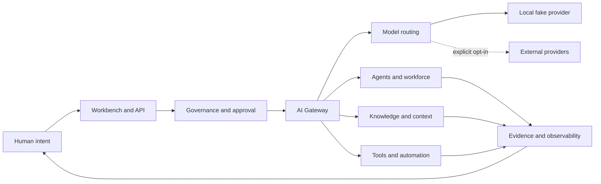

# Unified AI System

<p align="center">
  <strong>The open control plane for a future powered by many models, many agents, and human intent.</strong>
  <br />
  面向多模型、多智能体与人类意图的开放智能控制平面。
</p>

<p align="center">
  <a href="https://github.com/happy520ai/unified-ai-system/actions/workflows/ci.yml">
    
  </a>
  <a href="https://github.com/happy520ai/unified-ai-system/actions/workflows/docker-build-push.yml">
    
  </a>
  <a href="LICENSE">Apache-2.0</a>
</p>

<p align="center">
  <a href="#start-in-minutes">Quick start</a> |
  <a href="ROADMAP.md">Roadmap</a> |
  <a href="https://github.com/happy520ai/unified-ai-system/discussions">Discussions</a> |
  <a href="CONTRIBUTING.md">Contributing</a>
</p>

> **Intelligence is becoming abundant. The ability to own, route, govern, and
> trust it is not.**

Unified AI System exists to change that.

We are building an open, local-first gateway where models, tools, agents,
knowledge, and governed automation can work as one system without taking
control away from the people who operate it.

**我们相信，未来不会只属于某一个模型、某一家平台或某一种智能。**

真正重要的基础设施，是让每个人和每个组织都能自由选择模型、组合能力、
治理智能体、审计执行过程，并始终保有对数据、成本、权限与最终决策的控制权。

**One gateway. Many intelligences. Human authority at the center.**

<p align="center">
  
</p>

## The Mission

The next foundational layer of AI should not be another closed chat box.

It should be an open control plane that can:

- connect intelligence without locking users into one provider;
- coordinate agents without dissolving accountability;
- automate meaningful work without hiding risk;
- carry knowledge and context without surrendering data ownership;
- turn every important action into something observable, governable, and
  reversible.

Unified AI System is our attempt to build that layer in the open.

## Why This Matters

AI capability is expanding faster than the systems required to control it.
Models live behind incompatible APIs. Agents operate in isolated frameworks.
Tools, memory, permissions, cost controls, and audit trails are repeatedly
rebuilt as disconnected pieces.

That fragmentation is not merely inconvenient. It makes advanced AI harder to
trust, harder to move, and harder to place under meaningful human governance.

We believe the enduring breakthrough will come from making intelligence
**composable, portable, inspectable, and accountable**. A powerful model is a
component. A trustworthy system is the achievement.

## The Future We Are Building

| Direction | What it means |
| --- | --- |
| **Model freedom** | Applications choose the best available intelligence instead of being trapped by one vendor. |
| **Agent collaboration** | Specialized agents can plan, communicate, use tools, and contribute through explicit contracts. |
| **Governed execution** | Permissions, approvals, budgets, evidence, and rollback are part of execution, not an afterthought. |
| **Local sovereignty** | A useful system can start locally, without mandatory cloud dependence or provider credentials. |
| **Open evolution** | Providers, protocols, tools, evaluators, and safety mechanisms can improve through public contribution. |
| **Human authority** | People remain able to understand, interrupt, redirect, and own the systems acting on their behalf. |

The long-term ambition is an open foundation for increasingly general,
cooperative, and dependable machine intelligence.

That ambition is deliberately larger than the current implementation. We will
not call aspiration achievement: **AGI is not a marketing adjective here. It
is an evidence standard that must be earned.**

Follow the public [roadmap](ROADMAP.md) to see what is verifiable now, what is
being hardened next, and where contributors can have the most leverage.

## What Exists Today

Unified AI System is already a runnable open-source engineering workbench:

- **Unified gateway** for chat, streaming, routing, health, and diagnostics.
- **Local Workbench** for operating the gateway from a browser at `/ui`.
- **Provider layer** with explicit model selection and real-provider opt-in.
- **Agent and workforce modules** for structured planning and collaboration.
- **Knowledge and context systems** for retrieval, context shaping, and reuse.
- **Governance surfaces** for approval, permission, evidence, diagnostics, and
  observability.
- **Shared contracts and SDKs** for building reusable integrations.
- **Credential-free verification** through a deterministic local fake provider.
- **Public container** built for `linux/amd64` and `linux/arm64`.

## Reality Before Rhetoric

Great infrastructure earns trust by making its boundaries visible.

| Question | Verified answer |
| --- | --- |
| Can anyone view and clone the repository? | **Yes.** It is public under Apache-2.0. |
| Can a fresh clone run without an API key? | **Yes.** Installation, health, UI, and fake-provider chat are verified. |
| Can anyone pull the container image? | **Yes.** The `master` image is anonymously pullable from GHCR. |
| Is there a hosted public API? | **No.** Users run a local or self-hosted instance. |
| Can users connect real providers? | **Yes.** They supply their own credentials and explicitly enable execution. |
| Is this production-certified, L5, or established AGI? | **No such claim is made.** Those claims require independent evidence beyond local tests. |

## Start In Minutes

Requirements:

- Node.js 22 recommended; Node.js 20 or newer supported.
- pnpm 9.15.4 or newer.
- Git.

```bash
git clone https://github.com/happy520ai/unified-ai-system.git
cd unified-ai-system
corepack enable
corepack prepare pnpm@9.15.4 --activate
pnpm install --frozen-lockfile
pnpm verify:public-clone
pnpm start
```

Open:

- Workbench: [http://127.0.0.1:3100/ui](http://127.0.0.1:3100/ui)
- Health: [http://127.0.0.1:3100/health/check](http://127.0.0.1:3100/health/check)
- Setup readiness: [http://127.0.0.1:3100/setup/readiness](http://127.0.0.1:3100/setup/readiness)

The default configuration makes no external provider request.

## Run The Public Container

```bash
docker run --rm --publish 3100:3100 \
  ghcr.io/happy520ai/unified-ai-system/ai-gateway-service:master
```

Then open `http://127.0.0.1:3100/ui`.

The container defaults to the local fake provider. Use `--env-file .env` only
after reviewing [Provider setup](docs/providers.md).

## Call The Gateway

After starting the service:

```bash
curl --request POST http://127.0.0.1:3100/chat \
  --header "content-type: application/json" \
  --data "{\"prompt\":\"Hello from a public clone\"}"
```

This request stays on the local fake provider unless a real provider has been
explicitly configured.

## Architecture



The system is a modular monolith today: one deployable gateway with internal
ownership boundaries and reusable workspace packages. This keeps local use
simple while leaving clear paths for protocols, SDKs, and future service
separation.

Read the [architecture guide](docs/architecture.md) for details.

## Principles

- **Open by design.** Core behavior should be inspectable, extensible, and
  discussable in public.
- **Local first.** The first useful experience should not require credentials
  or surrender control to a remote platform.
- **Provider neutral.** Models are replaceable capabilities, not permanent
  architectural owners.
- **Governance native.** Approval, permission, cost, evidence, and rollback
  belong inside the execution path.
- **Evidence over theater.** Tests, reproducible runs, and independent
  evaluation matter more than ambitious labels.
- **Reversible progress.** Powerful automation must remain interruptible and
  recoverable.
- **Humans remain responsible.** The system can extend judgment; it must not
  erase ownership of decisions.

## Repository

```text
apps/
  agent-console/          Operator-facing console
  ai-gateway-service/     Main gateway runtime and Workbench
packages/                 Contracts, SDKs, configuration, and engines
capabilities/             Capability manifests used by the local system
model-routing/            Routing policies and model metadata
local-self-use/           Local operating helpers
docs/                     Public user and architecture documentation
tools/                    Maintained repository and runtime checks
```

Historical phase documents, generated evidence, and retired verifier trees are
kept off `master`. The pre-cleanup engineering history remains available on
[`codex/archive-before-public-core-cleanup-20260730`](https://github.com/happy520ai/unified-ai-system/tree/codex/archive-before-public-core-cleanup-20260730).

## Verification

```bash
pnpm check                 # Check every workspace package
pnpm test                  # Run maintained workspace tests
pnpm check:public          # Validate public-repository hygiene
pnpm verify:public-clone   # Start, probe, chat with, and stop the gateway
```

Every push to `master` also runs Linux CI and a real container startup smoke
test. The container test checks health, setup readiness, UI delivery, and local
fake-provider chat before publishing the multi-architecture image.

## Real Providers

Real provider calls are disabled by default. Users must provide their own
credentials, select a provider, and explicitly opt into real execution.

Never commit credentials or authorization inputs. Begin with
[`.env.example`](.env.example) and the
[provider guide](docs/providers.md).

## Build With Us

The project is ambitious, but it is still early enough for one excellent
contribution to reshape its foundations.

You can help by:

- building provider and tool adapters;
- improving agent protocols and workforce coordination;
- designing rigorous evaluations and safety gates;
- advancing local knowledge, memory, and context systems;
- making the Workbench clearer and more capable;
- strengthening deployment, observability, and documentation;
- challenging assumptions with evidence.

Read [CONTRIBUTING.md](CONTRIBUTING.md), open an issue, or send a focused pull
request. Security reports belong in [SECURITY.md](SECURITY.md).

If this direction resonates, star the repository and help turn an ambitious
open system into dependable public infrastructure.

Share the project with accurate, ready-to-use copy from the
[launch kit](docs/launch-kit.md), or start a conversation in
[GitHub Discussions](https://github.com/happy520ai/unified-ai-system/discussions).

---

**The future of AI should not be a black box owned by a few. It should be an
open system that many people can inspect, extend, govern, and trust.**

Licensed under [Apache-2.0](LICENSE).
