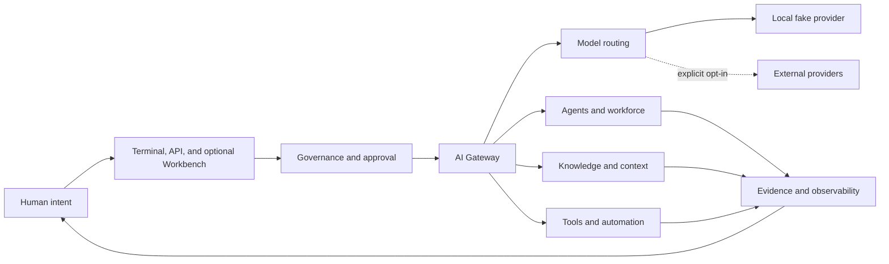

# Unified AI System

<p align="center">
  <strong>The open, local-first control plane for models, agents, knowledge, tools, and human intent.</strong>
</p>

<p align="center">
  <a href="README.md">English</a> |
  <a href="README.zh-CN.md">简体中文</a>
</p>

<p align="center">
  <a href="https://github.com/happy520ai/unified-ai-system/actions/workflows/ci.yml">
    
  </a>
  <a href="https://github.com/happy520ai/unified-ai-system/actions/workflows/docker-build-push.yml">
    
  </a>
  <a href="https://github.com/happy520ai/unified-ai-system/releases/latest">
    
  </a>
  <a href="LICENSE">
    
  </a>
</p>

Unified AI System is a self-hosted AI gateway that brings multi-model routing,
governed agents, knowledge, tools, approvals, and observability into one
operating surface.

It starts locally without an API key. Real providers remain explicit opt-in,
and human authority stays inside the execution path.

<p align="center">
  <a href="docs/assets/terminal-demo.png">
    
  </a>
</p>

<p align="center">
  <a href="https://github.com/happy520ai/unified-ai-system/discussions/5"><strong>Help shape the terminal-first CLI</strong></a>
  ·
  <a href="https://github.com/happy520ai/unified-ai-system/issues?q=is%3Aissue%20is%3Aopen%20label%3A%22good%20first%20issue%22">Pick a good first issue</a>
</p>

## Prove The Local Path

Run one isolated, credential-free terminal demo:

```bash
git clone https://github.com/happy520ai/unified-ai-system.git
cd unified-ai-system
corepack enable
corepack prepare pnpm@9.15.4 --activate
pnpm install --frozen-lockfile
pnpm demo
```

The demo starts the gateway on a temporary local port, verifies health, sends
one fake-provider chat request, and shuts the process down. It never calls a
real provider.

## Run The Gateway

Run the public container:

```bash
docker run --rm --publish 3100:3100 \
  ghcr.io/happy520ai/unified-ai-system/ai-gateway-service:master
```

Call it directly from another terminal:

```bash
curl --request POST http://127.0.0.1:3100/chat \
  --header "content-type: application/json" \
  --data "{\"prompt\":\"Hello from Unified AI System\"}"
```

The default runtime uses a deterministic local fake provider. The optional
Workbench remains available at
[http://127.0.0.1:3100/ui](http://127.0.0.1:3100/ui).

## What You Get

| Capability | Current public preview |
| --- | --- |
| **AI gateway** | Chat, streaming, health, diagnostics, explicit provider selection, and routing foundations. |
| **Governed agents** | Structured planning and workforce modules with approval, permission, and evidence surfaces. |
| **Knowledge and context** | Retrieval, context shaping, reusable knowledge, and memory-oriented modules. |
| **Terminal and API** | A self-cleaning terminal demo plus direct HTTP and shared SDK access. |
| **Optional Workbench** | A browser surface for operating and inspecting the local gateway. |
| **Extension layer** | Shared contracts, SDKs, context modules, provider adapters, and tools. |
| **Local-first runtime** | Credential-free startup plus an anonymously pullable multi-architecture container. |

## Why It Is Different

- **A control plane, not another chat skin.** Models, agents, knowledge, tools,
  permissions, and evidence belong in one governed execution path.
- **Useful before cloud configuration.** A fresh clone and the public container
  can prove the complete local path without provider credentials.
- **Human authority is architectural.** Real execution is explicit, observable,
  interruptible, and designed to remain accountable.

Read the longer [project vision](VISION.md) and the
[public roadmap](ROADMAP.md).

If this is the kind of open AI infrastructure you want to exist, star the
repository and join the
[terminal-first CLI design discussion](https://github.com/happy520ai/unified-ai-system/discussions/5).

## Run From Source

Requirements:

- Node.js 22 recommended; Node.js 20 or newer supported.
- pnpm 9.15.4 or newer.
- Git.

```bash
git clone https://github.com/happy520ai/unified-ai-system.git
cd unified-ai-system
corepack enable
corepack prepare pnpm@9.15.4 --activate
pnpm install --frozen-lockfile
pnpm verify:public-clone
pnpm demo
pnpm start
```

Useful local endpoints:

- Workbench: [http://127.0.0.1:3100/ui](http://127.0.0.1:3100/ui)
- Health: [http://127.0.0.1:3100/health/check](http://127.0.0.1:3100/health/check)
- Setup readiness: [http://127.0.0.1:3100/setup/readiness](http://127.0.0.1:3100/setup/readiness)

<details>
<summary>Optional browser Workbench preview</summary>


</details>

## Architecture



The system is currently a modular monolith: one deployable gateway with clear
internal ownership boundaries and reusable workspace packages. See the
[architecture guide](docs/architecture.md) for details.

## Honest Boundaries

| Question | Verified answer |
| --- | --- |
| Can anyone clone and inspect the project? | **Yes.** The repository is public under Apache-2.0. |
| Can a clean clone run without an API key? | **Yes.** Health, UI, and fake-provider chat are verified. |
| Is the container publicly pullable? | **Yes.** The `master` image is available from GHCR. |
| Is there a hosted public API? | **No.** Users run a local or self-hosted instance. |
| Can users connect real providers? | **Yes.** They supply credentials and explicitly enable execution. |
| Is this production-certified, L5, or established AGI? | **No such claim is made.** Those claims require operational and independent evidence beyond local tests. |

Real provider calls are disabled by default. Begin with
[`.env.example`](.env.example) and the
[provider guide](docs/providers.md), and never commit credentials.

## Verify The Project

```bash
pnpm check
pnpm test
pnpm check:public
pnpm verify:public-clone
```

Every push to `master` runs Linux CI and a real container startup smoke test.
The container path checks health, setup readiness, UI delivery, and
fake-provider chat before the multi-architecture image is published.

## Build With Us

The project is early enough for focused contributions to shape its foundations.
Current entry points include:

- [Add a credential-free JavaScript chat example](https://github.com/happy520ai/unified-ai-system/issues/2)
- [Document how to add and test a provider adapter](https://github.com/happy520ai/unified-ai-system/issues/3)
- [Audit Workbench keyboard navigation and focus states](https://github.com/happy520ai/unified-ai-system/issues/4)

Read [CONTRIBUTING.md](CONTRIBUTING.md), join
[Discussions](https://github.com/happy520ai/unified-ai-system/discussions), or
send a focused pull request. Security reports belong in
[SECURITY.md](SECURITY.md).

## Repository Map

```text
apps/
  agent-console/          Operator-facing console
  ai-gateway-service/     Main gateway runtime and Workbench
packages/                 Contracts, SDKs, configuration, and engines
capabilities/             Capability manifests used by the local system
model-routing/            Routing policies and model metadata
local-self-use/           Local operating helpers
docs/                     Public user and architecture documentation
tools/                    Maintained repository and runtime checks
```

Historical phase documents and generated evidence stay off `master`. The
pre-cleanup engineering history remains available on the
[archive branch](https://github.com/happy520ai/unified-ai-system/tree/codex/archive-before-public-core-cleanup-20260730).

## Project Links

- [v0.1.1 Terminal-First Preview](https://github.com/happy520ai/unified-ai-system/releases/tag/v0.1.1)
- [Documentation](docs/README.md)
- [Roadmap](ROADMAP.md)
- [Vision](VISION.md)
- [Support](SUPPORT.md)
- [Launch kit](docs/launch-kit.md)

If this direction is useful, star the repository so more builders can find it,
then tell us what the next trustworthy capability should be.

Licensed under [Apache-2.0](LICENSE).
