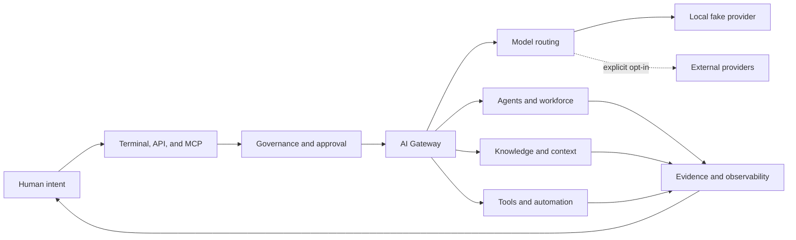

# Unified AI System

<p align="center">
  <strong>A terminal-first, self-hosted AI gateway for models, agents, knowledge, and tools.</strong>
</p>

<p align="center">
  <a href="README.md">English</a> |
  <a href="README.zh-CN.md">简体中文</a>
</p>

<p align="center">
  <a href="https://github.com/happy520ai/unified-ai-system/actions/workflows/ci.yml">
    
  </a>
  <a href="https://github.com/happy520ai/unified-ai-system/actions/workflows/docker-build-push.yml">
    
  </a>
  <a href="https://github.com/happy520ai/unified-ai-system/releases/latest">
    
  </a>
  <a href="https://registry.modelcontextprotocol.io/v0.1/servers/io.github.happy520ai%2Funified-ai-system/versions/0.3.2">
    
  </a>
  <a href="LICENSE">
    
  </a>
  <a href="https://codespaces.new/happy520ai/unified-ai-system?quickstart=1">
    
  </a>
</p>

Run and govern models, agents, knowledge, and tools through one open gateway.
The first verified request needs no account or API key; real providers remain
explicit opt-in and human authority stays inside the execution path.

<p align="center">
  <a href="docs/assets/terminal-demo.png">
    
  </a>
</p>

<p align="center">
  <a href="#connect-codex-through-mcp"><strong>Connect Codex in one command</strong></a>
  ·
  <a href="#one-command-demo">Run the gateway demo</a>
  ·
  <a href="https://github.com/happy520ai/unified-ai-system/issues?q=is%3Aissue%20is%3Aopen%20label%3A%22good%20first%20issue%22">Pick a good first issue</a>
</p>

## Connect Codex Through MCP

Run the gateway as a local MCP server with one anonymous container command:

```bash
codex mcp add unified-ai-system -- docker run --rm -i ghcr.io/happy520ai/unified-ai-system/mcp-server:0.3.2
```

Restart Codex, then use `/mcp` to inspect eight tools for gateway health,
readiness, fake-provider chat, knowledge, workflows, and workforce status. A
trusted source checkout also includes project-level Codex configuration, so
the direct Node entrypoint is discovered without maintaining a second config.

The dedicated MCP image starts its own isolated gateway and removes it when the
session ends. It fails closed if a gateway may call a real provider. See the
[MCP server guide](packages/mcp-server/README.md), the
[active official Registry entry](https://registry.modelcontextprotocol.io/v0.1/servers/io.github.happy520ai%2Funified-ai-system/versions/0.3.2),
and its source metadata in [`server.json`](server.json).

## One-Command Demo

With Docker installed, run the complete terminal demo without cloning the
repository:

```bash
docker run --rm ghcr.io/happy520ai/unified-ai-system/ai-gateway-service:0.3.2 pnpm gateway demo
```

The container starts an isolated gateway, verifies health, sends one
fake-provider chat request, prints the result, and removes itself. It never
calls a real provider.

To run the same path from source:

```bash
git clone https://github.com/happy520ai/unified-ai-system.git
cd unified-ai-system
corepack enable
corepack prepare pnpm@9.15.4 --activate
pnpm install --frozen-lockfile
pnpm gateway demo
```

The Codespaces button prepares Node.js 22, pnpm 9.15.4, and the workspace
dependencies in a browser terminal. Its container configuration pins the
gateway to fake-provider mode; run `pnpm gateway demo` after setup completes.

## Operate From The Terminal

The source checkout includes a real terminal interface rather than only a
scripted screenshot:

```bash
# Terminal 1
pnpm gateway serve

# Terminal 2
pnpm gateway status
pnpm gateway chat "Hello from Unified AI System"
pnpm gateway doctor
```

`demo`, `status`, `chat`, `doctor`, and `version` support `--json`. The chat
command refuses to send when a real provider may be active unless the operator
adds `--allow-real-provider` explicitly for that request. Read the
[CLI reference](docs/cli.md) for commands, exit codes, and safety behavior.

## Run The Gateway

Run the public container:

```bash
docker run --rm --publish 3100:3100 \
  ghcr.io/happy520ai/unified-ai-system/ai-gateway-service:0.3.2
```

Call it directly from another terminal:

```bash
curl --request POST http://127.0.0.1:3100/chat \
  --header "content-type: application/json" \
  --data "{\"prompt\":\"Hello from Unified AI System\"}"
```

The default runtime uses a deterministic local fake provider. Terminal and API
workflows are the public product surface; no browser UI is required or exposed
by default.

## What You Get

| Capability | Current public preview |
| --- | --- |
| **AI gateway** | Chat, streaming, health, diagnostics, explicit provider selection, and routing foundations. |
| **Governed agents** | Structured planning and workforce modules with approval, permission, and evidence surfaces. |
| **Knowledge and context** | Retrieval, context shaping, reusable knowledge, and memory-oriented modules. |
| **Terminal and API** | CLI commands for demo, startup, status, chat, and diagnostics, plus direct HTTP and shared SDK access. |
| **Codex and MCP** | A stdio MCP server with eight tested tools, project-level Codex configuration, and a no-clone Docker command. |
| **Extension layer** | Shared contracts, SDKs, context modules, provider adapters, and tools. |
| **Local-first runtime** | Credential-free startup plus an anonymously pullable multi-architecture container. |

## Why It Is Different

- **A control plane, not another chat skin.** Models, agents, knowledge, tools,
  permissions, and evidence belong in one governed execution path.
- **Useful before cloud configuration.** A fresh clone and the public container
  can prove the complete local path without provider credentials.
- **Human authority is architectural.** Real execution is explicit, observable,
  interruptible, and designed to remain accountable.

Read the longer [project vision](VISION.md) and the
[public roadmap](ROADMAP.md).

If this is the kind of open AI infrastructure you want to exist, star the
repository and join the
[Codex MCP launch discussion](https://github.com/happy520ai/unified-ai-system/discussions/6).

## Run From Source

Requirements:

- Node.js 22 recommended; Node.js 20 or newer supported.
- pnpm 9.15.4 or newer.
- Git.

```bash
git clone https://github.com/happy520ai/unified-ai-system.git
cd unified-ai-system
corepack enable
corepack prepare pnpm@9.15.4 --activate
pnpm install --frozen-lockfile
pnpm verify:public-clone
pnpm gateway demo
pnpm gateway serve
```

Useful local endpoints:

- Health: [http://127.0.0.1:3100/health/check](http://127.0.0.1:3100/health/check)
- Setup readiness: [http://127.0.0.1:3100/setup/readiness](http://127.0.0.1:3100/setup/readiness)

## Architecture



The system is currently a modular monolith: one deployable gateway with clear
internal ownership boundaries and reusable workspace packages. See the
[architecture guide](docs/architecture.md) for details.

## Honest Boundaries

| Question | Verified answer |
| --- | --- |
| Can anyone clone and inspect the project? | **Yes.** The repository is public under Apache-2.0. |
| Can a clean clone run without an API key? | **Yes.** Health and fake-provider chat are verified. |
| Is the container publicly pullable? | **Yes.** The `master` image is available from GHCR. |
| Is there a hosted public API? | **No.** Users run a local or self-hosted instance. |
| Can users connect real providers? | **Yes.** They supply credentials and explicitly enable execution. |
| Is this production-certified, L5, or established AGI? | **No such claim is made.** Those claims require operational and independent evidence beyond local tests. |

Real provider calls are disabled by default. Begin with
[`.env.example`](.env.example) and the
[provider guide](docs/providers.md), and never commit credentials.

## Verify The Project

```bash
pnpm check
pnpm test
pnpm check:public
pnpm verify:public-clone
pnpm verify:mcp
```

Every push to `master` runs Linux CI and a real container startup smoke test.
The container path checks health, setup readiness, the terminal-only public
surface, fake-provider chat, the MCP handshake, tool discovery, and managed
process cleanup before the multi-architecture image is published.

## Build With Us

The project is early enough for focused contributions to shape its foundations.
Current entry points include:

- [Add a credential-free JavaScript chat example](https://github.com/happy520ai/unified-ai-system/issues/2)
- [Document how to add and test a provider adapter](https://github.com/happy520ai/unified-ai-system/issues/3)
- [Help shape the next terminal-first CLI commands](https://github.com/happy520ai/unified-ai-system/discussions/5)

Read [CONTRIBUTING.md](CONTRIBUTING.md), join
[Discussions](https://github.com/happy520ai/unified-ai-system/discussions), or
send a focused pull request. Security reports belong in
[SECURITY.md](SECURITY.md).

## Repository Map

```text
apps/
  agent-console/          Terminal CLI and operator interaction
  ai-gateway-service/     Main gateway runtime and HTTP API
packages/
  mcp-server/             Codex-ready stdio MCP server
  ...                     Contracts, SDKs, configuration, and engines
docs/                     Public user and architecture documentation
tools/                    Maintained repository and runtime checks
```

Historical phase documents and generated evidence stay off `master`. The
pre-cleanup engineering history remains available on the
[archive branch](https://github.com/happy520ai/unified-ai-system/tree/codex/archive-before-public-core-cleanup-20260730).

## Project Links

- [Official MCP Registry entry](https://registry.modelcontextprotocol.io/v0.1/servers/io.github.happy520ai%2Funified-ai-system/versions/0.3.2)
- [v0.3.2 Discovery Metadata](https://github.com/happy520ai/unified-ai-system/releases/tag/v0.3.2)
- [v0.3.1 MCP Registry Distribution](https://github.com/happy520ai/unified-ai-system/releases/tag/v0.3.1)
- [v0.3.0 Terminal and Codex MCP Preview](https://github.com/happy520ai/unified-ai-system/releases/tag/v0.3.0)
- [v0.2.0 Terminal CLI Preview](https://github.com/happy520ai/unified-ai-system/releases/tag/v0.2.0)
- [Codex MCP server](packages/mcp-server/README.md)
- [Documentation](docs/README.md)
- [Roadmap](ROADMAP.md)
- [Vision](VISION.md)
- [Support](SUPPORT.md)
- [Launch kit](docs/launch-kit.md)

If this direction is useful, star the repository so more builders can find it,
then tell us what the next trustworthy capability should be.

Licensed under [Apache-2.0](LICENSE).
