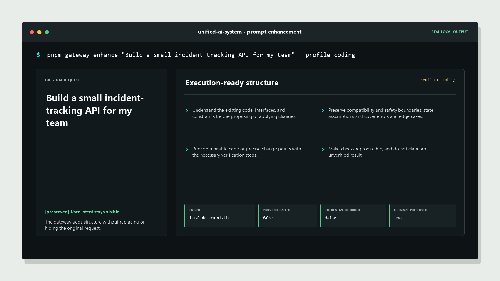

# Unified AI System

<p align="center">
  <strong>Open-source AI gateway for deterministic prompt enhancement, governed execution, and reproducible verification.</strong>
</p>

<p align="center">
  <a href="README.md">English</a> |
  <a href="README.zh-CN.md">zh-CN</a> |
  <a href="https://happy520ai.github.io/unified-ai-system/">Project Site</a>
</p>

<p align="center">
  <a href="https://codespaces.new/happy520ai/unified-ai-system?quickstart=1">
    
  </a>
</p>

<p align="center">
  <a href="https://github.com/happy520ai/unified-ai-system/stargazers">
    
  </a>
  <a href="https://github.com/happy520ai/unified-ai-system/actions/workflows/ci.yml">
    
  </a>
  <a href="https://github.com/happy520ai/unified-ai-system/actions/workflows/docker-build-push.yml">
    
  </a>
  <a href="https://github.com/happy520ai/unified-ai-system/actions/workflows/hol-plugin-scanner.yml">
    
  </a>
  <a href="https://github.com/happy520ai/unified-ai-system/releases/latest">
    
  </a>
  <a href="https://registry.modelcontextprotocol.io/v0.1/servers/io.github.happy520ai%2Funified-ai-system/versions/0.4.2">
    
  </a>
  <a href="LICENSE">
    
  </a>
</p>

Unified AI System is a public gateway for models, agents, knowledge, and tools.
It is built for teams that want rough natural language turned into executable intent before a model call, with explicit provider opt-in and evidence-first verification.

This is not a chat UI wrapper. It is a control plane for AI workflow execution.

**Start here:** [run the 60-second demo](#try-it-in-60-seconds), [open it in Codespaces](https://codespaces.new/happy520ai/unified-ai-system?quickstart=1), and [star the repository](https://github.com/happy520ai/unified-ai-system) if it helps your workflow. Share one verified result in [Issue #20](https://github.com/happy520ai/unified-ai-system/issues/20).

## Why People Use It

- Prompt enhancement for teammates who do not write perfect prompts.
- Clean-clone verification without credentials or hidden setup.
- Provider-free HTTP examples for curl and Python's standard library.
- CLI, HTTP API, SDK, MCP, Codex, Cursor, and Cline entry points.
- Clear boundaries: no AGI claim, no L5 claim, no silent provider behavior.

<p align="center">
  <a href="https://happy520ai.github.io/unified-ai-system/#enhance">
    
  </a>
  <br />
  <sub>v0.4.2: deterministic enhancement, no API key, no provider call.</sub>
</p>

## Try It in 60 Seconds

Verify the project without signing in:

```bash
docker run --rm ghcr.io/happy520ai/unified-ai-system/ai-gateway-service:0.4.2 pnpm gateway demo
```

Expected behavior:

- local fake-provider execution
- visible `execution: fake`
- deterministic output
- no API key or account needed
- container exits automatically

One-command natural-language enhancement preview:

```bash
docker run --rm ghcr.io/happy520ai/unified-ai-system/ai-gateway-service:0.4.2 \
  pnpm gateway demo "Build a small API for my team" --enhance --profile coding
```

This starts an isolated fake-provider gateway, enhances the request locally,
prints the structured prompt, and cleans up without an API key.

Prompt enhancement example:

Start the gateway first (from a source checkout):

```bash
pnpm gateway serve
```

Then, in another terminal:

```bash
pnpm gateway enhance "Build a small API for my team" --profile coding
pnpm gateway chat "Build a small API for my team" --enhance --profile coding
```

For a no-clone prompt-enhancement walkthrough, start the published gateway
image and follow the [provider-free curl example](docs/examples/prompt-enhancement-curl.md):

```bash
docker run --rm --publish 3100:3100 \
  --env AI_GATEWAY_SERVICE_HOST=0.0.0.0 \
  --env AI_GATEWAY_PROVIDER_MODE=fake \
  --env AI_GATEWAY_REAL_PROVIDER_ENABLED=false \
  ghcr.io/happy520ai/unified-ai-system/ai-gateway-service:0.4.2
```

Keep that process running while you send the curl request. The response
includes `metadata.providerCalled=false`. For a credential-free HTTP stream,
use the [curl SSE example](docs/examples/streaming-chat-curl.md) to inspect
`start`, `chunk`, and `done` events with `executionMode=fake`.

## Use It

### Terminal Workflow

After `pnpm install`:

```bash
pnpm gateway serve
pnpm gateway status
pnpm gateway doctor
pnpm gateway chat "Hello from Unified AI System"
```

### MCP / Codex / Cursor / Cline

Published MCP command:

```bash
codex mcp add unified-ai-system -- docker run --rm -i ghcr.io/happy520ai/unified-ai-system/mcp-server:0.4.2
```

Restart Codex, run `/mcp verbose` to verify the nine tools, then follow the
[60-second Codex MCP quickstart](docs/codex-mcp-quickstart.md) for a safe first
prompt-enhancement call and removal command.

### Installable Agent Skill

```bash
codex plugin marketplace add happy520ai/unified-ai-system --ref master
npx skills add happy520ai/unified-ai-system --skill unified-ai-gateway --agent codex --copy --yes
```

Skill hub: https://skills.sh/happy520ai/unified-ai-system/unified-ai-gateway

For local source work:

```bash
git clone https://github.com/happy520ai/unified-ai-system.git
cd unified-ai-system
corepack enable
corepack prepare pnpm@9.15.4 --activate
pnpm install --frozen-lockfile
pnpm verify:public-clone
pnpm gateway demo
```

For a prepared cloud workspace, use [GitHub Codespaces](https://codespaces.new/happy520ai/unified-ai-system?quickstart=1), then run:

```bash
pnpm verify:public-clone
pnpm gateway demo "Build a small API for my team" --enhance --profile coding
```

The repository's devcontainer keeps the default path provider-free. Codespaces
availability and usage limits are controlled by GitHub.

## Help It Grow

If the project is useful, star the repository and keep the loop factual:

1. Run one reproducible command and keep the output.
2. Share one short post with the repo link.
3. Ask for OS + one output line in issue #20.
4. Save one verified result in `docs/star-growth-evidence-pack.md`.

Useful links:

- [Documentation](docs/README.md)
- [Launch kit](docs/launch-kit.md)
- [Community promotion pack](docs/community-promotion-pack.md)
- [Growth post templates](docs/growth-post-templates.md)
- [Growth dashboard](docs/star-growth-dashboard.md)
- [Growth evidence pack](docs/star-growth-evidence-pack.md)
- [Growth checklist](docs/star-growth-checklist.md)
- [Usage verification issue template](.github/ISSUE_TEMPLATE/usage-verification-report.yml)
- [Codex for Open Source application draft](docs/codex-for-open-source-application.md)
- [Codex for Open Source submission copy](docs/codex-for-open-source-submit.md)

## Honest Boundaries

We separate what is verified from what is not claimed:

- Clean clone + fake-provider path: **Yes**
- Hosted public API: **No**
- Real provider execution by default: **No**, must be explicitly enabled
- Browser chat UI in this repo: **No** (CLI/API/MCP are first-class)
- Production ready / AGI / L5: **Not claimed**

Real provider calls are disabled by default. Configure safely via `.env.example` and `docs/providers.md`.

## Verify the Project

```bash
pnpm check
pnpm test
pnpm check:public
pnpm verify:public-clone
pnpm verify:mcp
```

CI on `master` runs Linux checks, container startup smoke tests, MCP discovery, and process-cleanup checks.

## Project Links

- [Official MCP Registry entry](https://registry.modelcontextprotocol.io/v0.1/servers/io.github.happy520ai%2Funified-ai-system/versions/0.4.2)
- [Release v0.4.2](https://github.com/happy520ai/unified-ai-system/releases/tag/v0.4.2)
- [Codex MCP server README](packages/mcp-server/README.md)
- [Roadmap](ROADMAP.md)
- [Vision](VISION.md)
- [Support](SUPPORT.md)
