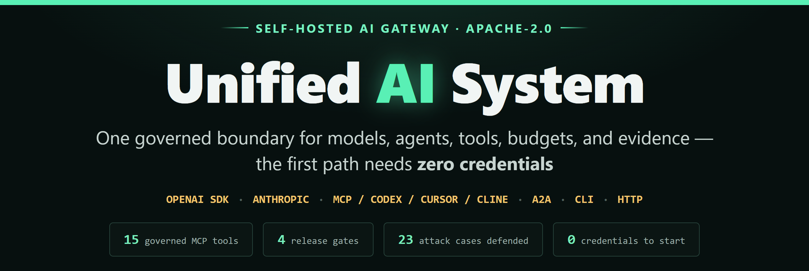
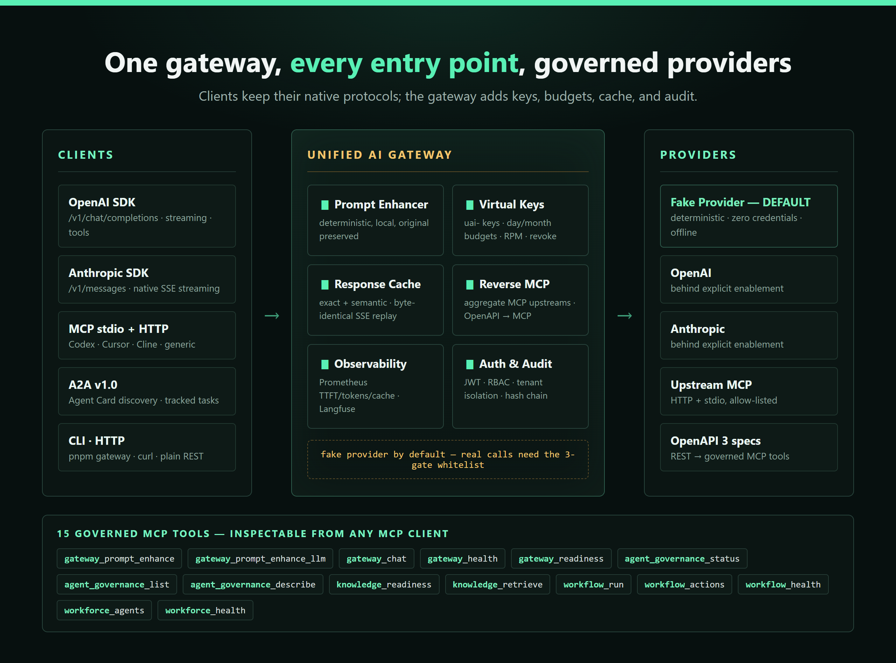
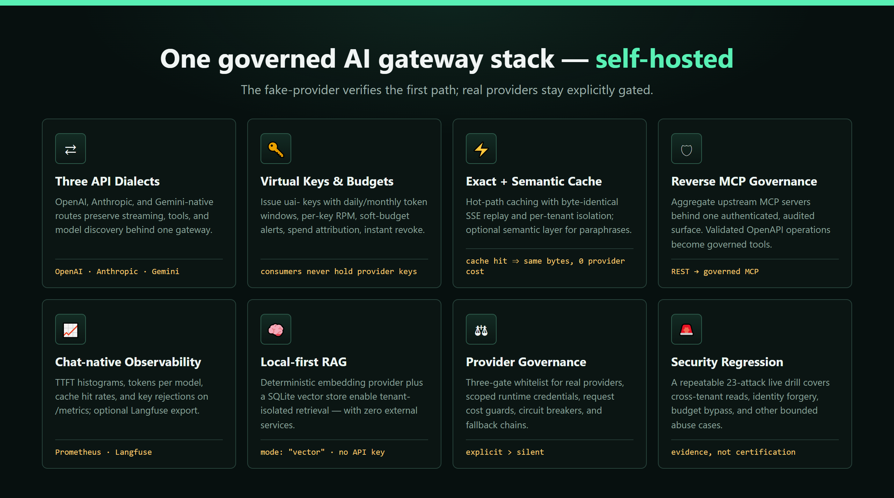
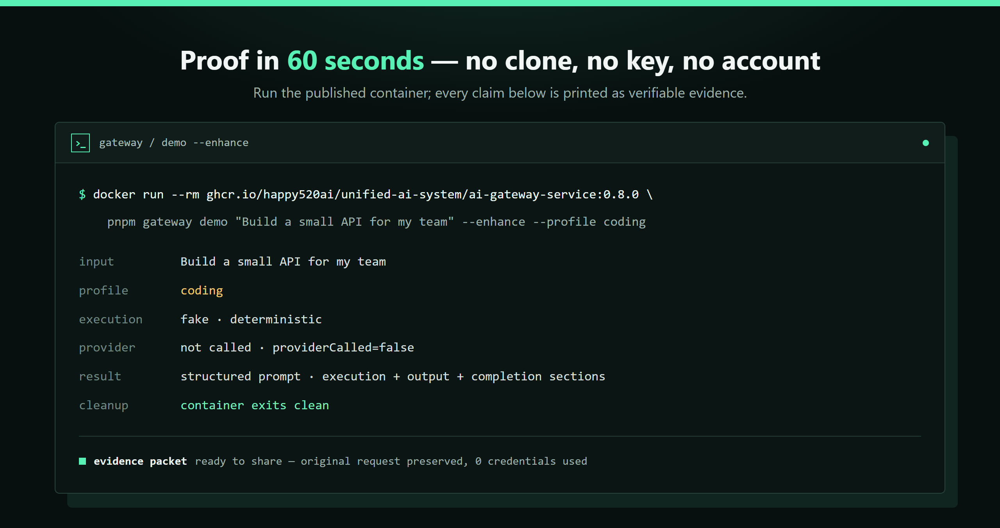

# Unified AI System：自托管 AI 网关与 MCP Server

<p align="center">
  <strong>面向自然语言增强、受治理执行与可复现验证的开源 AI 网关。</strong>
</p>

<p align="center">
  <a href="README.md">English</a> |
  <a href="README.zh-CN.md">简体中文</a> |
  <a href="https://happy520ai.github.io/unified-ai-system/">项目主页</a>
</p>

<p align="center">
  <a href="https://github.com/happy520ai/unified-ai-system">
    
  </a>
  <a href="https://github.com/happy520ai/unified-ai-system/actions/workflows/ci.yml">
    
  </a>
  <a href="https://github.com/happy520ai/unified-ai-system/actions/workflows/docker-build-push.yml">
    
  </a>
  <a href="https://github.com/happy520ai/unified-ai-system/releases/latest">
    
  </a>
  
  <a href="https://registry.modelcontextprotocol.io/v0.1/servers/io.github.happy520ai%2Funified-ai-system/versions/0.5.0">
    
  </a>
  <a href="LICENSE">
    
  </a>
</p>

Unified AI System 会在执行前，把一句自然语言需求整理成结构化、可审阅的提示词。它为 OpenAI 兼容 SDK、MCP、A2A、CLI 和 HTTP 提供统一的自托管入口，同时让 provider 调用保持显式。

> **当前成熟度：加固后的 Public Preview。** 零凭证路径可复现并受 CI
> 门禁；生产部署仍需要使用方完成真实 Provider staging、HA/DR 演练、
> 独立安全评审和持续运行证据。

<p align="center">
  <a href="https://happy520ai.github.io/unified-ai-system/#enhance?prompt=%E5%B8%AE%E6%88%91%E4%B8%BA%E5%9B%A2%E9%98%9F%E8%AE%BE%E8%AE%A1%E4%B8%80%E4%B8%AA%E5%B0%8F%E5%9E%8B+API&amp;profile=coding&amp;language=zh-CN">
    
  </a>
  <br />
  <sub>原始需求保持可见；本地增强器会补充执行要求、输出要求和完成标准。</sub>
</p>

## 无需安装，直接体验

<p align="center">
  
</p>

[**在浏览器 Prompt Lab 中打开一个可直接运行的 coding 示例**](https://happy520ai.github.io/unified-ai-system/#enhance?prompt=%E5%B8%AE%E6%88%91%E4%B8%BA%E5%9B%A2%E9%98%9F%E8%AE%BE%E8%AE%A1%E4%B8%80%E4%B8%AA%E5%B0%8F%E5%9E%8B+API&profile=coding&language=zh-CN)

链接会自动载入真实请求，并在浏览器本地生成增强结果，不需要账号、
API Key，也不会调用 provider。

也可以用已发布容器运行同一条验证：

```bash
docker run --rm ghcr.io/happy520ai/unified-ai-system/ai-gateway-service:0.5.0 pnpm gateway demo "帮我为团队设计一个小型 API" --enhance --profile coding --evidence
```

证据会确认原始请求被保留、结果具有确定性，并显示
`providerCalled=false`。Codex、VS Code、Claude Code、Gemini CLI、OpenCode、
Cursor、Cline、Continue 和通用 stdio 客户端都可以通过同一个网关
访问十二个受治理 MCP 工具。

在真实工作流中有帮助？欢迎[给仓库点 Star](https://github.com/happy520ai/unified-ai-system)，或[分享一条可复现结果](https://github.com/happy520ai/unified-ai-system/issues/new?template=usage-verification-report.yml&title=%5BUsage%20Report%5D%20Quickstart)。

## 一图看懂网关

<p align="center">
  
  <br />
  <sub>客户端保持原生协议；网关统一加上 key、预算、缓存与审计。12 个受治理 MCP 工具可被任意 MCP 客户端检查。</sub>
</p>

## 选择入口

| 你的目标 | 从这里开始 | 你会得到什么 |
| --- | --- | --- |
| 安装前先体验 | [在线 Prompt Lab](https://happy520ai.github.io/unified-ai-system/#enhance) | 无需账号或 API Key 的本地确定性预览。 |
| 验证已发布运行时 | [60 秒 Docker 体验](README.zh-CN.md#60-秒体验) | 可见证据、自动清理的 fake provider 一次性运行。 |
| 接入智能体客户端 | [Codex 与 MCP 快速开始](https://happy520ai.github.io/unified-ai-system/codex-mcp-docker-quickstart.zh-CN.html) | 固定版本 MCP 容器与 12 个可检查工具。 |
| 选择客户端路径 | [MCP 客户端兼容性矩阵](docs/mcp-client-compatibility.zh-CN.md) | 安装命令、首次检查和明确的证据边界。 |
| 集成到应用 | [自然语言提示词增强指南](https://happy520ai.github.io/unified-ai-system/prompt-enhancement.zh-CN.html) | CLI、HTTP、SDK、curl、Python 和 JavaScript 路径。 |
| 保留现有 OpenAI 客户端 | [OpenAI 兼容 API](docs/openai-compatible-api.zh-CN.md) | 把 `baseURL` 指向 `/v1`，使用 Chat Completions、函数工具、Responses、流式响应和模型发现。 |
| 接入其他智能体 | [A2A v1.0 网关](docs/a2a-protocol.zh-CN.md) | 可选验签 Agent Card/JWKS，并通过 JSON-RPC 执行租户隔离的 fake-provider 任务；支持有界 memory 或同主机持久存储。 |
| 检查协议覆盖 | [协议兼容性矩阵](docs/protocol-client-compatibility.zh-CN.md) | 区分官方 SDK 证据和具名客户端认证。 |
| 检查客户端真实运行认证 | [客户端运行时认证](docs/client-runtime-certification.md) | 当前有证据支持的目录状态：2,136 个唯一项中 52 项已验证、2,084 项待人工证据、0 项失败。 |
| 检查增强契约 | [无凭据评估](docs/prompt-enhancement.md#prompt-enhancement-evaluation) | 用 8 个代表性案例检查 profile、语言、信号、确定性和零 Provider 调用。 |
| 排查首次运行问题 | [首次运行排障矩阵](docs/first-run-troubleshooting.zh-CN.md) | 针对不同 Shell 的检查，不暴露凭据。 |
| 贡献或报告运行结果 | [结构化使用报告](https://github.com/happy520ai/unified-ai-system/issues/new?template=usage-verification-report.yml) 或 [入门任务 #106](https://github.com/happy520ai/unified-ai-system/issues/106) | 用户与维护者都能复现的反馈入口。 |
| 验证 MCP 客户端 | [MCP 客户端报告](https://github.com/happy520ai/unified-ai-system/issues/new?template=mcp-client-report.yml) | 记录一次 Codex、Cursor、Cline 或通用 stdio 客户端运行。 |

## 网关能力全景

以下能力全部跑在同一个自托管进程里——按需开启、fake provider 优先，
零凭证即可试用每一项：

<p align="center">
  
</p>

| 能力 | 你能得到什么 | 文档 |
| --- | --- | --- |
| OpenAI + Anthropic + Gemini 兼容 API | `/v1/chat/completions`（SSE 流式、工具调用、图片/音频多模态、n>1 多候选）、**原生 Anthropic 流式 + prompt caching（cache_control 透传）**的 `/v1/messages`、**Gemini 原生入站** `:generateContent/:streamGenerateContent/:batchGenerateContent`、Responses API、模型发现——保留现有 SDK，只改 base URL。 | [OpenAI 兼容 API](docs/openai-compatible-api.md) · [Gemini](docs/gemini-provider.md) |
| 虚拟 key + 预算 | 签发 `uai-` key，支持按周期 token 预算（日/月窗口）、每 key 请求限速、软预算告警、花费归因、即时吊销；消费方永远拿不到 provider 密钥。 | [虚拟 key](docs/virtual-keys.md) · [花费报表](docs/spend-reporting.md) |
| 响应缓存（精确 + 语义） | 租户隔离的热路径缓存，JSON/SSE 字节级重放；可选语义层命中同义改述；TTL/大小上限 + 完整审计。 | [响应缓存](docs/response-cache-hot-path.md) |
| Guardrails（确定性本地护栏） | 输入/输出双向扫描：粘贴密钥拦截、PII 脱敏、注入话术告警、违禁词与长度限制——无云依赖、零额外凭证、实测开销 <0.2ms、每条规则可运行时配置。 | [Guardrails](docs/guardrails.md) |
| 反向 MCP 治理 | 把上游 MCP server（Streamable HTTP / stdio）聚合到一个认证、审计、白名单的统一入口——还有 **REST→MCP**：任意 OpenAPI 3 规格一键变成受治理的 MCP 工具。 | [反向 MCP 治理](docs/reverse-mcp-governance.md) |
| 可观测性 | `/metrics` 暴露 chat 专属 Prometheus 指标——分模型 token、缓存命中率、TTFT 直方图、虚拟 key 拒绝、**真实 p50/p95/p99 延迟分位数**——外加可选 Langfuse 导出与按 key 花费报表（API/CLI）。 | [可观测性](docs/observability-export.md) |
| 向量检索 + 热路径 RAG | 零凭证确定性 embedding（可插拔 HTTP 真实 embedding）+ SQLite 向量库激活 `mode: "vector"` 检索；`unified_ai.rag` 在 `/v1/chat/completions` 上按请求注入带来源的知识上下文。 | [Provider 与知识库](docs/providers.md) |
| 流量治理 | 运营可配的**加权分流**与**影子流量**（`AI_GATEWAY_WEIGHTED_ROUTES_JSON`）：影子调用独立进入成本账本；真实 provider 影子还要求 `AI_GATEWAY_SHADOW_REAL_PROVIDER_ENABLED=true`。 | [多进程部署](docs/multi-process-deployment.md) |
| Provider 治理 | 真实 provider 三道门白名单矩阵、运行时凭证库（SHA-256 落存 + file 金库解析）、请求成本守卫、熔断器、fallback 链。 | [真实 provider 启用](docs/real-provider-enablement.md) |
| 企业身份与供给 | **OIDC SSO**（授权码+PKCE+JWKS 验签，登录即发 API token）与 **SCIM 2.0** 用户供给（Bearer 鉴权，create/get/list/patch/deactivate）；RBAC、审计哈希链租户隔离，16+ 项攻击安全回归守护。 | [安全演练](tools/security-attack-regression.mjs) |
| 本地计费台账 | 客户/用量/开票/作废/收款登记的 JSONL 台账（未接支付网关：票据如实标注为对账单，非法律发票）。 | [花费报表](docs/spend-reporting.md) |
| 多实例控制 | `AI_GATEWAY_MULTI_INSTANCE=true` 保留同主机 SQLite 默认；PostgreSQL 模式覆盖跨主机配额、响应幂等、调度墓碑、WebSocket/A2A/Workforce 租约与终态 fence、审批、中央计费用量和共享 HMAC 审计链。当前源码还以持久 effect tombstone 约束受治理的不可逆内建工具、Webhook、MCP/OpenAPI mutation 与自定义工具；破坏性 CI 演练恢复 PostgreSQL 17、建立真实异步流复制 standby、证明 WAL 重放，并由“连续三次失败 + 二次确认”的有界控制器自动提升唯一 standby、切换稳定端点及用同一八类客户端复核。这是单 standby 自动 failover 与 TTL 内 at-most-once 准入证据，不等于 Provider 侧 exactly-once、多候选选主/quorum、外部 HA 控制器、PITR、split-brain 安全或生产 RTO/RPO；可恢复调用栈、完整 HA/DR、外部 WORM 与已认证 Provider 对账仍属于部署工作。 | [多进程部署](docs/multi-process-deployment.md) · [PostgreSQL 恢复演练](docs/postgresql-recovery-drill.md) · [外部副作用 fencing](docs/external-effect-fencing.md) |

已发布基础设施基准（fake provider、单机）：chat JSON p50 **15.6 ms**、SSE 首字 **2.8 ms**、并发 8 下 **402 req/s**、缓存命中比未命中快 **5.6×**——见[网关基准报告](docs/benchmarks/2026-08-gateway-benchmark.md)。

## 为什么使用它

- 不擅长写提示词的用户，也能从自然语言开始工作。
- 无需账号或密钥即可完成干净克隆验证。
- 提供 curl、Python 标准库和 JavaScript 的无 provider 示例。
- 同时支持 OpenAI SDK、CLI、HTTP API、共享 SDK、MCP、Codex、Cursor、Cline 和 Continue。
- 默认使用本地 fake provider，真实 provider 必须显式启用。
- 不声称 AGI、L5 或生产就绪，只展示可以复现的行为。

## 60 秒体验

<p align="center">
  
</p>

无需登录，直接验证发布镜像：

```bash
docker run --rm ghcr.io/happy520ai/unified-ai-system/ai-gateway-service:0.5.0 pnpm gateway demo
```

你将看到：

- 本地 fake provider 执行
- 明确的 `execution: fake`
- 可重复的输出
- 不需要 API Key 或账号
- 容器自动退出并清理

用一条命令体验自然语言增强：

```bash
docker run --rm ghcr.io/happy520ai/unified-ai-system/ai-gateway-service:0.5.0 \
  pnpm gateway demo "帮我为团队设计一个小型 API" --enhance --profile coding --evidence
```

网关会在本地增强请求、输出结构化提示词，然后自动清理隔离进程，全程不调用真实 provider。
如果需要指定输出语言，可以使用 `--language zh-CN` 或 `--language en`；省略时默认自动检测。

## 常用工作流

### 终端

从源码安装后：

```bash
pnpm gateway serve
pnpm gateway status
pnpm gateway doctor
pnpm gateway enhance "帮我为团队设计一个小型 API" --profile coding
pnpm gateway chat "帮我为团队设计一个小型 API" --enhance --profile coding
```

如果偏好 Node.js，可运行只使用内置模块的示例；它会先验证 provider-free
响应，再输出增强后的 JSON：

```bash
node docs/examples/prompt-enhancement.mjs "帮我为团队规划一个小型 API" --profile planning --language zh-CN
```

如果偏好 Go，可运行只使用标准库的示例；它会先验证网关处于
provider-free 模式，再输出包含安全证据的增强 JSON：

```bash
go run docs/examples/prompt-enhancement.go "帮我为团队规划一个小型 API" --profile planning --language zh-CN
```

完整的 HTTP 示例见[自然语言增强指南](docs/prompt-enhancement.md)，其中包含跨平台 curl、Python、Node.js 和 SDK 用法。

### 现有 OpenAI SDK

先用 `pnpm gateway serve` 启动源码网关，然后保留现有 OpenAI 客户端，只修改
它的 base URL：

```js
import OpenAI from "openai";

const client = new OpenAI({
  baseURL: "http://127.0.0.1:3100/v1",
  apiKey: process.env.PME_AUTH_TOKEN || "local-development",
});

const result = await client.chat.completions.create({
  model: "local-fake-model",
  messages: [{ role: "user", content: "帮我为团队设计一个小型 API" }],
});

console.log(result.choices[0].message.content);
```

无凭据门禁使用官方 OpenAI JavaScript SDK `7.4.0` 验证这条路径。源码网关运行时，
可以直接复现：

```bash
node docs/examples/openai-sdk-chat.mjs
```

这个聚焦的兼容层支持文本完成、流式响应、模型列表和可选的本地提示词增强。
Python 示例、支持字段、鉴权方式和明确限制见
[OpenAI 兼容 API 指南](docs/openai-compatible-api.zh-CN.md)。

### MCP、Codex、Cursor、Cline

直接添加已发布的 MCP 镜像：

```bash
codex mcp add unified-ai-system -- docker run --rm -i ghcr.io/happy520ai/unified-ai-system/mcp-server:0.5.0
```

重启 Codex 后运行 `/mcp` 检查连接，再参考 [Codex MCP 60 秒快速开始](https://happy520ai.github.io/unified-ai-system/codex-mcp-docker-quickstart.zh-CN.html)。
项目提供十二个工具，包括健康检查、自然语言增强、聊天、知识、工作流和 workforce 能力。

需要通过 URL 接入的 MCP 客户端，可以使用源码提供的仅本机监听 Streamable HTTP 入口：

```bash
pnpm mcp:http
# http://127.0.0.1:3210/mcp
```

远程绑定的鉴权要求与发布版本边界见 [MCP Server 指南](packages/mcp-server/README.md#streamable-http)。

### 可安装的 Agent Skill

```bash
codex plugin marketplace add happy520ai/unified-ai-system --ref master
npx skills add happy520ai/unified-ai-system --skill unified-ai-gateway --agent codex --copy --yes
```

插件固定使用[已审查的 v0.4.9 不可变 MCP 镜像](docs/security/mcp-image-review-0.4.9.md)，
启动时禁用容器网络并移除 Linux capabilities。

Skill 主页：<https://skills.sh/happy520ai/unified-ai-system/unified-ai-gateway>

### 从源码运行

需要 Node.js 22.18.0 或更高版本，以及 pnpm 11.19.0。

```bash
git clone https://github.com/happy520ai/unified-ai-system.git
cd unified-ai-system
corepack enable
corepack prepare pnpm@11.19.0 --activate
pnpm install --frozen-lockfile
pnpm verify:public-clone
pnpm gateway demo
```

源码开发和完整验证需要 Node.js 22.18.0 或更高版本；Docker 快速路径不需要本地 Node.js。

如果不想配置本地环境，可以直接使用 [GitHub Codespaces](https://codespaces.new/happy520ai/unified-ai-system?quickstart=1)。工作区准备完成后先运行一条命令查看结果：

```bash
pnpm gateway demo "帮我为团队设计一个小型 API" --enhance --profile coding --evidence
```

如需执行完整的无凭据公共克隆检查，再运行 `pnpm verify:public-clone`。
仓库的 devcontainer 默认保持 provider-free。Codespaces 的可用性和使用额度由 GitHub 控制。

### Docker Compose

如果使用源码目录，可以通过 Compose 启动网关并等待就绪检查：

```bash
docker compose up --build -d
docker compose ps
curl http://127.0.0.1:3100/health/check
```

只有 `/health/check` 成功响应后，服务才会显示为 `healthy`。使用完成后执行：

```bash
docker compose down
```

Compose 将 `.env` 视为可选配置，并保持 provider 行为显式；无凭据的 fake-provider 路径仍是默认路径。

## 分享可验证结果

如果这个项目对你的工作流有帮助，请运行一条可复现路径、[给仓库点 Star](https://github.com/happy520ai/unified-ai-system)，再通过[结构化使用报告](https://github.com/happy520ai/unified-ai-system/issues/new?template=usage-verification-report.yml)分享最小且有用的结果。

如果希望直接生成可复核的 CLI 证据包，可在增强 demo 后追加 `--evidence`：

```bash
pnpm gateway demo "帮我为团队设计一个小型 API" --enhance --profile coding --language zh-CN --evidence
```

分享前请检查原始请求和输出内容。

如果使用浏览器 Prompt Lab，可以点击“复制证据”或“下载证据”，再把 JSON 粘贴或附加到同一模板里的可选 Prompt Lab evidence 字段。
如果希望其他浏览器复现同一个本地场景，可以点击“复制分享链接”；分享前请检查原始请求，因为 URL 片段会包含输入文本。

## 下一步

- [文档总览](docs/README.md)：安装、CLI、自然语言增强与 provider 配置。
- [Codex MCP 快速开始](https://happy520ai.github.io/unified-ai-system/codex-mcp-docker-quickstart.zh-CN.html)：最快接入 Codex 与 MCP；仓库内同时保留[源码指南](docs/codex-mcp-quickstart.md)。
- [贡献指南](CONTRIBUTING.md)：聚焦改动与安全验证要求。
- [使用报告模板](.github/ISSUE_TEMPLATE/usage-verification-report.yml)：提交可复现反馈。
- [引用本项目](CITATION.cff)、[路线图](ROADMAP.md)与[支持页面](SUPPORT.md)。

## 诚实边界

- 干净克隆和 fake provider 路径：**已验证**
- 托管的公共 API：**没有**
- 默认真实 provider 执行：**没有**，必须显式启用
- 仓库内置浏览器聊天 UI：**没有**，CLI、API 和 MCP 是一等入口
- 生产就绪、AGI、L5：**不声称**

真实 provider 默认关闭。请参考 `.env.example` 和[provider 配置指南](docs/providers.md)进行显式配置。

## 验证项目

```bash
pnpm check
pnpm test
pnpm check:public
pnpm verify:public-clone
pnpm verify:mcp
```

## 管道式自然语言输入

当没有提供位置参数或 `--prompt` 时，`demo`、`enhance` 和 `chat` 会从
stdin 读取请求，适合接入 Shell 管道、文本文件和编辑器脚本：

```bash
printf '%s' "帮我规划一个小型 API 的发布" |
  pnpm gateway enhance --profile planning --language zh-CN
cat request.txt | pnpm gateway enhance --profile auto --json
```

PowerShell 可以这样使用：

```powershell
Get-Content .\request.txt -Raw |
  pnpm gateway enhance --profile auto --json
```

输入会在发送到网关前去除首尾空白。`chat` 仍会执行正常的 provider
安全检查；从 stdin 读取请求不会授权真实 provider。

`master` 上的 CI 会执行 Linux 检查、容器启动 smoke test、MCP 发现和进程清理验证。

## 项目链接

- [官方 MCP Registry 条目](https://registry.modelcontextprotocol.io/v0.1/servers/io.github.happy520ai%2Funified-ai-system/versions/0.5.0)
- [Release v0.5.0](https://github.com/happy520ai/unified-ai-system/releases/tag/v0.5.0)
- [Codex MCP Server README](packages/mcp-server/README.md)
- [Roadmap](ROADMAP.md)
- [Vision](VISION.md)
- [Support](SUPPORT.md)

## Star History

如果这个网关帮你省了一次代理迁移或一下午的提示词整理，
[点个 star](https://github.com/happy520ai/unified-ai-system/stargazers) 能让更多人看到它。

[](https://star-history.com/#happy520ai/unified-ai-system&Date)
