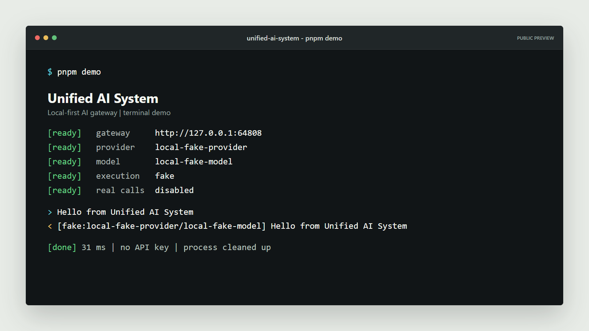
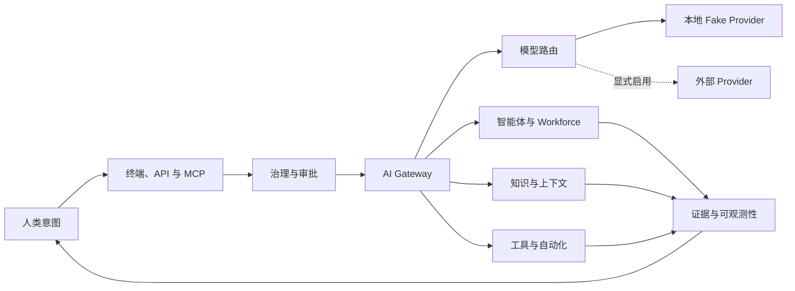

# Unified AI System

<p align="center">
  <strong>面向模型、智能体、知识与工具的终端优先、自托管 AI 能力网关。</strong>
</p>

<p align="center">
  <a href="README.md">English</a> |
  <a href="README.zh-CN.md">简体中文</a>
</p>

<p align="center">
  <a href="https://github.com/happy520ai/unified-ai-system/actions/workflows/ci.yml">
    
  </a>
  <a href="https://github.com/happy520ai/unified-ai-system/releases/latest">
    
  </a>
  <a href="https://registry.modelcontextprotocol.io/v0.1/servers/io.github.happy520ai%2Funified-ai-system/versions/0.3.2">
    
  </a>
  <a href="LICENSE">
    
  </a>
  <a href="https://codespaces.new/happy520ai/unified-ai-system?quickstart=1">
    
  </a>
</p>

通过一个开放网关运行和治理模型、智能体、知识与工具。第一次完整验证无需
账号或 API Key；真实 Provider 始终需要显式启用，人类的最终控制权保留在
执行链路之中。

<p align="center">
  <a href="docs/assets/terminal-demo.png">
    
  </a>
</p>

<p align="center">
  <a href="#通过-mcp-接入-codex"><strong>一行命令接入 Codex</strong></a>
  ·
  <a href="#一行命令完成演示">运行网关 Demo</a>
  ·
  <a href="https://github.com/happy520ai/unified-ai-system/issues?q=is%3Aissue%20is%3Aopen%20label%3A%22good%20first%20issue%22">认领新手任务</a>
</p>

## 通过 MCP 接入 Codex

使用一条匿名容器命令，把网关添加为本地 MCP Server：

```bash
codex mcp add unified-ai-system -- docker run --rm -i ghcr.io/happy520ai/unified-ai-system/mcp-server:0.3.2
```

重启 Codex 后，使用 `/mcp` 查看 8 个工具，覆盖网关健康、就绪状态、
Fake Provider 对话、知识基础设施、Workflow 与 Workforce 状态。可信任的
源码工作区已经包含直接启动 Node 入口的项目级 Codex 配置，无需重复维护另一份
配置。

专用 MCP 镜像会自动启动隔离网关，并在会话结束后清理进程；只要网关可能调用
真实 Provider，它就会拒绝启动或发送对话。完整说明见
[MCP Server 指南](packages/mcp-server/README.md)、
[官方 Registry active 条目](https://registry.modelcontextprotocol.io/v0.1/servers/io.github.happy520ai%2Funified-ai-system/versions/0.3.2)
和 [`server.json`](server.json) 中的源元数据。

在 Codex 中可以先尝试这个任务：

> 使用 Unified AI System MCP 工具检查网关健康状态和就绪状态；只有网关明确证明
> 处于纯 Fake 模式时，才通过 Gateway Chat 发送 `MCP_READY`。报告 Provider、
> Model、执行模式和响应。

按照 [60 秒 Codex MCP 快速上手](docs/codex-mcp-quickstart.md)可以继续完成三个
安全任务，并查看预期证据、诊断方法和卸载命令。

## 一行命令完成演示

已经安装 Docker 时，无需克隆仓库即可运行完整终端 Demo：

```bash
docker run --rm ghcr.io/happy520ai/unified-ai-system/ai-gateway-service:0.3.2 pnpm gateway demo
```

容器会启动隔离网关、验证健康状态、发送一次 Fake Provider 对话、打印结果并
自动删除自身。整个过程不会调用任何真实 Provider。

从源码运行同一条验证链路：

```bash
git clone https://github.com/happy520ai/unified-ai-system.git
cd unified-ai-system
corepack enable
corepack prepare pnpm@9.15.4 --activate
pnpm install --frozen-lockfile
pnpm gateway demo
```

上方 Codespaces 按钮会在浏览器终端准备 Node.js 22、pnpm 9.15.4 和工作区
依赖。容器配置固定使用 Fake Provider 模式；准备完成后运行
`pnpm gateway demo` 即可。

## 使用终端操作

源码仓库提供的是可实际使用的终端入口，而不只是一张演示截图：

```bash
# 终端 1
pnpm gateway serve

# 终端 2
pnpm gateway status
pnpm gateway chat "你好，Unified AI System"
pnpm gateway doctor
```

`demo`、`status`、`chat`、`doctor` 和 `version` 都支持 `--json`。如果网关可能
使用真实 Provider，`chat` 会在发送请求之前停止；只有为本次命令显式增加
`--allow-real-provider` 才会继续。完整命令、退出码与安全行为见
[CLI 文档](docs/cli.md)。

## 持续运行网关

直接运行公开容器：

```bash
docker run --rm --publish 3100:3100 \
  ghcr.io/happy520ai/unified-ai-system/ai-gateway-service:0.3.2
```

在另一个终端直接调用网关：

```bash
curl --request POST http://127.0.0.1:3100/chat \
  --header "content-type: application/json" \
  --data "{\"prompt\":\"你好，Unified AI System\"}"
```

默认运行时使用确定性的本地 Fake Provider。终端与 API 是公开产品入口；系统
默认不暴露浏览器 UI，运行网关也不依赖它。

## 当前具备什么

| 能力 | 当前公开预览版 |
| --- | --- |
| **AI 网关** | Chat、流式响应、健康检查、诊断、显式 Provider 选择与路由基础。 |
| **受治理智能体** | 结构化规划与 Workforce 模块，以及审批、权限和执行证据界面。 |
| **知识与上下文** | 检索、上下文塑形、知识复用和面向记忆的模块。 |
| **终端与 API** | Demo、启动、状态、Chat 与诊断命令，以及直接 HTTP 和共享 SDK 访问。 |
| **Codex 与 MCP** | 经过测试的 8 工具 stdio MCP Server、项目级 Codex 配置与免克隆 Docker 命令。 |
| **扩展层** | 共享协议、SDK、上下文模块、Provider 适配器与工具。 |
| **本地优先运行时** | 无凭证启动，以及可匿名拉取的多架构容器。 |

## 为什么要做这个项目

- **它是控制平面，不是另一个聊天外壳。** 模型、智能体、知识、工具、权限和
  执行证据应当进入同一条可治理链路。
- **在配置云服务之前就能使用。** 全新克隆和公开容器都可以在没有 Provider
  凭证的情况下验证完整本地路径。
- **人类控制权属于架构本身。** 真实执行必须显式启用、可观察、可中断并且
  能够追责。

更完整的长期方向请阅读[项目愿景](VISION.md)和[公开路线图](ROADMAP.md)。

如果你也希望这样的开放 AI 基础设施真正成长起来，请为仓库点一个 Star，并参与
[Codex MCP 发布讨论](https://github.com/happy520ai/unified-ai-system/discussions/6)。

## 从源码运行

环境要求：

- 推荐 Node.js 22，最低支持 Node.js 20。
- pnpm 9.15.4 或更高版本。
- Git。

```bash
git clone https://github.com/happy520ai/unified-ai-system.git
cd unified-ai-system
corepack enable
corepack prepare pnpm@9.15.4 --activate
pnpm install --frozen-lockfile
pnpm verify:public-clone
pnpm gateway demo
pnpm gateway serve
```

本地入口：

- 健康检查：[http://127.0.0.1:3100/health/check](http://127.0.0.1:3100/health/check)
- 配置就绪检查：[http://127.0.0.1:3100/setup/readiness](http://127.0.0.1:3100/setup/readiness)

## 架构



当前系统采用模块化单体架构：一个可部署网关，内部拥有清晰的职责边界和可复用
工作区包。详细说明见[架构文档](docs/architecture.md)。

## 真实边界

| 问题 | 已验证答案 |
| --- | --- |
| 所有人都可以克隆和查看项目吗？ | **可以。** 仓库采用 Apache-2.0 协议公开。 |
| 全新克隆无需 API Key 就能运行吗？ | **可以。** 健康检查和 Fake Provider Chat 已验证。 |
| 容器可以公开拉取吗？ | **可以。** GHCR 提供 `master` 镜像。 |
| 当前提供公网托管 API 吗？ | **不提供。** 用户运行本地或自行部署的实例。 |
| 可以连接真实 Provider 吗？ | **可以。** 用户自行提供凭证并显式启用执行。 |
| 已经是生产认证、L5 或真正 AGI 吗？ | **没有这样的宣称。** 这些结论需要长期运行和独立评估证据，不能由本地测试替代。 |

真实 Provider 默认关闭。请从 [`.env.example`](.env.example) 和
[Provider 配置指南](docs/providers.md)开始，并且永远不要提交凭证。

## 验证项目

```bash
pnpm check
pnpm test
pnpm check:public
pnpm verify:public-clone
pnpm verify:mcp
```

每次推送到 `master` 都会运行 Linux CI 和真实容器启动冒烟测试，包括健康检查、
配置就绪、终端优先公开边界、Fake Provider Chat、MCP 握手、工具发现与进程清理。

## 参与建设

当前适合开始贡献的任务：

- [为 Docker MCP Server 补充通用客户端配置](https://github.com/happy520ai/unified-ai-system/issues/9)
- [为无凭证快速上手补充 PowerShell 示例](https://github.com/happy520ai/unified-ai-system/issues/10)
- [说明如何增加和测试 Provider 适配器](https://github.com/happy520ai/unified-ai-system/issues/3)

你也可以[一起设计下一批终端优先 CLI 命令](https://github.com/happy520ai/unified-ai-system/discussions/5)。

阅读[贡献指南](CONTRIBUTING.md)、加入
[Discussions](https://github.com/happy520ai/unified-ai-system/discussions)，或提交一个
范围清晰的 Pull Request。安全问题请按照 [SECURITY.md](SECURITY.md) 报告。

## 项目入口

- [官方 MCP Registry 条目](https://registry.modelcontextprotocol.io/v0.1/servers/io.github.happy520ai%2Funified-ai-system/versions/0.3.2)
- [v0.3.2 发现元数据版](https://github.com/happy520ai/unified-ai-system/releases/tag/v0.3.2)
- [v0.3.1 MCP Registry 分发版](https://github.com/happy520ai/unified-ai-system/releases/tag/v0.3.1)
- [v0.3.0 终端与 Codex MCP 预览版](https://github.com/happy520ai/unified-ai-system/releases/tag/v0.3.0)
- [v0.2.0 终端 CLI 预览版](https://github.com/happy520ai/unified-ai-system/releases/tag/v0.2.0)
- [Codex MCP Server](packages/mcp-server/README.md)
- [文档索引](docs/README.md)
- [公开路线图](ROADMAP.md)
- [项目愿景](VISION.md)
- [支持方式](SUPPORT.md)

如果你认同这个方向，请 Star 仓库，让更多建设者看到它，并告诉我们下一项真正
值得信任的能力应该是什么。

项目采用 [Apache-2.0](LICENSE) 许可证。
