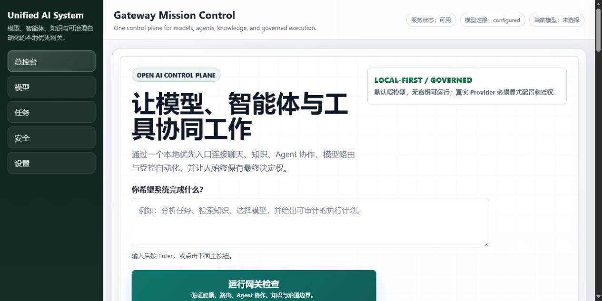

# Unified AI System

<p align="center">
  <strong>连接模型、智能体、知识、工具与人类意图的开放式本地优先控制平面。</strong>
</p>

<p align="center">
  <a href="README.md">English</a> |
  <a href="README.zh-CN.md">简体中文</a>
</p>

<p align="center">
  <a href="https://github.com/happy520ai/unified-ai-system/actions/workflows/ci.yml">
    
  </a>
  <a href="https://github.com/happy520ai/unified-ai-system/releases/latest">
    
  </a>
  <a href="LICENSE">
    
  </a>
</p>

Unified AI System 是一个可自行部署的 AI 能力网关，把多模型路由、受治理的
智能体、知识、工具、审批与可观测性放进同一个操作界面。

它无需 API Key 即可在本地启动。真实 Provider 必须由用户主动配置和启用，
人类的最终控制权始终位于执行链路之中。

<p align="center">
  <a href="docs/assets/workbench-overview.png">
    
  </a>
</p>

## 60 秒开始体验

直接运行公开容器：

```bash
docker run --rm --publish 3100:3100 \
  ghcr.io/happy520ai/unified-ai-system/ai-gateway-service:master
```

打开 [http://127.0.0.1:3100/ui](http://127.0.0.1:3100/ui)，或直接调用网关：

```bash
curl --request POST http://127.0.0.1:3100/chat \
  --header "content-type: application/json" \
  --data "{\"prompt\":\"你好，Unified AI System\"}"
```

首次运行使用确定性的本地 Fake Provider，不会向任何外部模型发送请求。

## 当前具备什么

| 能力 | 当前公开预览版 |
| --- | --- |
| **AI 网关** | Chat、流式响应、健康检查、诊断、显式 Provider 选择与路由基础。 |
| **受治理智能体** | 结构化规划与 Workforce 模块，以及审批、权限和执行证据界面。 |
| **知识与上下文** | 检索、上下文塑形、知识复用和面向记忆的模块。 |
| **Mission Control** | 用于操作和检查本地网关的浏览器 Workbench。 |
| **扩展层** | 共享协议、SDK、Provider 适配器、工具与 MCP 封装。 |
| **本地优先运行时** | 无凭证启动，以及可匿名拉取的多架构容器。 |

## 为什么要做这个项目

- **它是控制平面，不是另一个聊天外壳。** 模型、智能体、知识、工具、权限和
  执行证据应当进入同一条可治理链路。
- **在配置云服务之前就能使用。** 全新克隆和公开容器都可以在没有 Provider
  凭证的情况下验证完整本地路径。
- **人类控制权属于架构本身。** 真实执行必须显式启用、可观察、可中断并且
  能够追责。

更完整的长期方向请阅读[项目愿景](VISION.md)和[公开路线图](ROADMAP.md)。

## 从源码运行

环境要求：

- 推荐 Node.js 22，最低支持 Node.js 20。
- pnpm 9.15.4 或更高版本。
- Git。

```bash
git clone https://github.com/happy520ai/unified-ai-system.git
cd unified-ai-system
corepack enable
corepack prepare pnpm@9.15.4 --activate
pnpm install --frozen-lockfile
pnpm verify:public-clone
pnpm start
```

本地入口：

- Workbench：[http://127.0.0.1:3100/ui](http://127.0.0.1:3100/ui)
- 健康检查：[http://127.0.0.1:3100/health/check](http://127.0.0.1:3100/health/check)
- 配置就绪检查：[http://127.0.0.1:3100/setup/readiness](http://127.0.0.1:3100/setup/readiness)

## 架构


当前系统采用模块化单体架构：一个可部署网关，内部拥有清晰的职责边界和可复用
工作区包。详细说明见[架构文档](docs/architecture.md)。

## 真实边界

| 问题 | 已验证答案 |
| --- | --- |
| 所有人都可以克隆和查看项目吗？ | **可以。** 仓库采用 Apache-2.0 协议公开。 |
| 全新克隆无需 API Key 就能运行吗？ | **可以。** 健康检查、UI 和 Fake Provider Chat 已验证。 |
| 容器可以公开拉取吗？ | **可以。** GHCR 提供 `master` 镜像。 |
| 当前提供公网托管 API 吗？ | **不提供。** 用户运行本地或自行部署的实例。 |
| 可以连接真实 Provider 吗？ | **可以。** 用户自行提供凭证并显式启用执行。 |
| 已经是生产认证、L5 或真正 AGI 吗？ | **没有这样的宣称。** 这些结论需要长期运行和独立评估证据，不能由本地测试替代。 |

真实 Provider 默认关闭。请从 [`.env.example`](.env.example) 和
[Provider 配置指南](docs/providers.md)开始，并且永远不要提交凭证。

## 验证项目

```bash
pnpm check
pnpm test
pnpm check:public
pnpm verify:public-clone
```

每次推送到 `master` 都会运行 Linux CI 和真实容器启动冒烟测试，包括健康检查、
配置就绪、UI 返回和 Fake Provider Chat。

## 参与建设

当前适合开始贡献的任务：

- [增加一个无凭证 JavaScript Chat 示例](https://github.com/happy520ai/unified-ai-system/issues/2)
- [说明如何增加和测试 Provider 适配器](https://github.com/happy520ai/unified-ai-system/issues/3)
- [审计 Workbench 键盘导航与焦点状态](https://github.com/happy520ai/unified-ai-system/issues/4)

阅读[贡献指南](CONTRIBUTING.md)、加入
[Discussions](https://github.com/happy520ai/unified-ai-system/discussions)，或提交一个
范围清晰的 Pull Request。安全问题请按照 [SECURITY.md](SECURITY.md) 报告。

## 项目入口

- [v0.1.0 Public Preview](https://github.com/happy520ai/unified-ai-system/releases/tag/v0.1.0)
- [文档索引](docs/README.md)
- [公开路线图](ROADMAP.md)
- [项目愿景](VISION.md)
- [支持方式](SUPPORT.md)

如果你认同这个方向，请 Star 仓库，让更多建设者看到它，并告诉我们下一项真正
值得信任的能力应该是什么。

项目采用 [Apache-2.0](LICENSE) 许可证。
