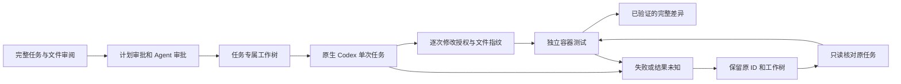

# 在原任务内使用原生 Codex

显式选择一个服务器配置的 `externalRunner` 后，Workforce 可以把后端实现交给本机原生 Codex，并保留原计划、审批、隔离工作树和产物证据。其他角色继续生成本地分析；普通 Gateway 角色配置保持可用。一次原生任务只提交一个新 turn，恢复操作只读取该 turn，不会再次请求模型、重跑员工或自动继续父任务。

原生完成消息只表示 Codex 停止工作。只有实际文件修改经过权限检查、完整差异得到核对、固定测试在独立容器通过、相关进程确认退出且证据成功保存，状态才会成为 `verified`。



## 当前支持与明确限制

- 当前进程实现面向 Windows x64 和经过固定哈希绑定的 Codex CLI `0.153.4`。Linux/macOS 配置类型不代表这两个平台已有可执行实现；不支持的平台在启动前拒绝。
- 必须使用本地执行控制和本机工作树。多实例、分布式执行控制不进入这一通道。
- 原生进程继承其原有环境与登录。网关不读取原生认证记录，也不覆盖模型、Provider、Base URL、推理等级、服务等级或认证参数。原生返回的模型与 Provider 必须匹配审阅配置。
- 固定启动参数关闭 shell、插件、应用、hooks、子代理、图像、目标管理、sleep、工具推荐与 shell snapshot 等额外能力；文件修改只接受逐项 `accept`，拒绝会话级授权、命令授权、扩大根目录和凭据回调。
- 运行时使用实验接口中的独立命名权限：根目录默认拒绝、最小运行文件可读、工作区默认拒绝、明确文件可读、网络关闭。不接受旧 sandbox 回退。某些 Windows 原生沙箱不能执行这种细分读取限制；原生返回“不支持且拒绝无沙箱运行”时，本次任务失败，必须先处理原生环境支持问题。
- `disabledMcpServers` 只关闭明确列出的原生 MCP 配置。空对象不是清空设置，含点的服务器 ID 目前拒绝。此通道没有读取任意原生配置的能力，也不能证明未知 MCP 配置在启动阶段没有副作用。应使用已明确掌握其配置的原生运行环境；观察到不允许的工具调用会停止原任务，但这种观察不等于启动前隔离证明。

本地测试、脚本模型、原生启动检查、真实原生模型调用、托管 CI 与部署运行是不同的证据。配置存在、命名权限被接受或测试替身通过，都不能单独证明实际文件读取隔离或生产可用。

## 配置与审阅

服务器接受 `AI_GATEWAY_WORKFORCE_EXTERNAL_RUNNER_PROFILES_JSON`：最多 16 个完整配置，每个包含固定的程序路径、SHA-256、版本、预期原生模型和 Provider、明确的 MCP 排除项、基线提交、读写文件清单、不可修改测试的哈希、固定验证命令、镜像摘要及资源上限。请求只能选择 `externalRunner: { profileId }`，不能提交程序路径、环境、模型覆盖或执行回调。

启用需要 `AI_GATEWAY_WORKFORCE_EXTERNAL_RUNNER_ENABLED=true` 和既有的 `WORKFORCE_EXECUTION_ENABLED=true`。同时设置：

| 设置 | 含义 |
| --- | --- |
| `AI_GATEWAY_WORKFORCE_EXTERNAL_RUNNER_HOST_PATH` | 本机编译的 `workforce-native-job-host.exe` 绝对路径 |
| `AI_GATEWAY_WORKFORCE_EXTERNAL_RUNNER_HOST_SHA256` | 该文件的实际 SHA-256 |
| `AI_GATEWAY_WORKFORCE_EXTERNAL_RUNNER_ENGINE_PATH` | 已安装的 Docker 兼容验证引擎绝对路径 |
| `AI_GATEWAY_WORKFORCE_EXTERNAL_RUNNER_SCRATCH_ROOT` | 可选，已存在的独立快照目录 |

helper 旁的 `build-manifest.json`、helper 文件哈希和当前 C++ 源文件哈希必须一致。构建工具不安装服务、不提权、不修改原生 Codex 配置：

程序路径必须是实际规范路径。目录链接或盘符迁移可能使常用的 C 盘路径指向 E 盘；即使文件哈希相同，也需要在配置中使用核对后的规范目标路径，不能绕过路径检查。

```text
node tools/build-workforce-native-job-host.mjs --tests --output <工作区 evidence/product-final 下的新绝对目录>
node tools/test-workforce-native-job-host.mjs --build-dir <构建目录>
node tools/test-workforce-external-runner-process.mjs --build-dir <构建目录>
```

默认 Agent 策略不授予代码执行。通过现有治理入口配置适当的策略版本，明确允许写入、代码执行以及 `file_read`、`file_write`、`file_edit`、`workforce_verify_snapshot`，并限制到准确的项目路径。恢复另需允许 `workforce_external_runner_recover`。`workforce_execute` 可以保留独立的人审审批。记录数上限、无法返回完整产物的字段排除、缺失预算或逐工具等待审批等不支持的策略，在执行前拒绝。

先通过已认证客户端调用 `POST /workforce/execute/review`，或 SDK 的 `workforceExecutionReview`。示例请求：

```json
{
  "goal": "实现已经明确的后端修改",
  "planId": "native-plan-001",
  "agentId": "agt_your_issued_agent",
  "autonomyMode": "controlled-execution",
  "externalRunner": { "profileId": "your-configured-profile" }
}
```

审阅返回完整任务提示词、文件内容指纹、配置和计划摘要。源文件、目标、版本、路径、限制或提示词变化都会改变审批绑定。提示词或序列化请求过大时直接拒绝，不截断。

使用相同请求在 `/workforce/execute/approve` 提交 `approvedScopes: ["workforce:execute"]`，再调用 `/workforce/execute` 或 SDK 的 `workforceExecute`。如果 Agent Tool Proxy 返回待审批，通过现有命令查看完整内容后批准，再提交同一请求：

```text
pnpm gateway agents approvals --agent-id <原 Agent ID>
pnpm gateway agents approve --approval-id <返回的审批 ID> --yes
```

不要把恢复操作用于重试模型。新的任务、修改后的输入或新的原生 turn 必须重新审阅和审批。

## 如何核对结果和恢复

`POST /workforce/execute/status`、SDK 的 `workforceExecutionStatus` 和 `pnpm gateway workforce status <execution-id>` 读取原生命周期。`externalRunner.metadata` 保存审阅绑定，`externalRunner.state` 保存原线程、turn、文件修改回执、差异和测试结果。

`fileApprovals` 在每次原生接受修改之前保存审批与修改摘要，完成后保存实际文件指纹；多次修改必须接成连续的文件指纹链。原生用量通知保存在 `nativeUsage`，它是最后一次观测，不是账单或最终用量证明。没有通知时为 `null`。原生模型请求数未知时同样保持 `null`，不会把它记成零次 Gateway 调用。

失败或不确定结果保留工作树。恢复 JSON 只能包含原记录中的三个 ID：

```json
{
  "executionId": "原 executionId",
  "operationId": "原 operationId",
  "agentId": "原 agentId"
}
```

```text
pnpm gateway workforce native-recover --input recovery.json
pnpm gateway workforce native-recover --input recovery.json --yes
```

同一能力也通过 `POST /workforce/execute/external-runner/recover` 和 SDK 的 `recoverWorkforceExternalRunner` 提供。恢复首先排除仍在运行的原执行者，核对 Windows 进程创建时间和工作树身份，然后只读取原线程历史。历史必须包含唯一匹配的原输入、原 turn 及已保存的文件修改回执，当前文件还必须匹配最后一次完成指纹。

每个恢复观察进程都有独立记录。未确认退出的观察进程会阻止再次启动；只读核对证明它已经停止后，才可以继续。未知进程身份、缺失修改回执、工作树替换、文件变化、未确认的旧验证容器清理，都保持失败或未知状态。恢复不会依据持久化 PID 杀进程。

重新验证通过后可以恢复原生子任务的证据。父任务保留原记录状态，甚至可能仍显示重启前的“运行中”；这不代表父任务已重新运行。应单独核对父任务状态和后续动作。

## 验证与回滚

单元与模块测试覆盖协议、精确权限、真实 Git 工作树、DAG 和 Agent 权限、独立测试、审批持久化、进程关闭、原任务恢复与 HTTP 审批链。Windows helper 测试运行真实子进程树；进程适配器测试使用明确标注的 Node 复制件充当字节流夹具。它们不会调用真实原生账户模型。

新启动可通过关闭 `AI_GATEWAY_WORKFORCE_EXTERNAL_RUNNER_ENABLED` 停止。源代码回退可以撤销此功能；保留原生命周期、审批和待恢复工作树。不要把删除历史、工作树或原生登录文件作为回滚步骤。没有新数据库表、依赖或常驻服务，本功能也不会自动安装或修改原生运行环境。

## Language Selection

Workload: bounded native protocol I/O, current approval checks, durable original-task reconciliation and immutable artifact verification across the existing Workforce, governance, HTTP, SDK and CLI layers.

| Option | Domain fit | Maintenance | Operability | Safety | Migration | Ecosystem | Total |
| --- | ---: | ---: | ---: | ---: | ---: | ---: | ---: |
| TypeScript for protocol, state and business behavior | 5 | 5 | 5 | 5 | 5 | 5 | 30 |
| JavaScript for the new business runtime | 5 | 4 | 5 | 3 | 5 | 5 | 27 |
| Existing C++ boundary for fixed Win32 process primitives | 5 | 4 | 4 | 5 | 4 | 5 | 27 |
| PowerShell as the process owner | 3 | 4 | 3 | 2 | 4 | 4 | 20 |

These are design scores. C++ is limited to suspended launch, Windows Job Objects, handle inheritance and parent-process monitoring; Node.js does not expose this combined ownership boundary. Fixed PowerShell calls only query process identity or signal the private cancellation event. Build and component-test tools remain Node.js ESM.

The file-count and line-count review points are exceeded because one native task must remain bound across all existing approval, execution, artifact, persistence and client surfaces. The implementation reuses existing lifecycle storage, claimed DAG tasks, Tool Proxy and the existing snapshot verifier. It adds no parallel project system, event bus or new model-routing path. Only explicit native requests use the v7 approval digest; ordinary role execution keeps its existing configuration and approval behavior.

The protocol shape is pinned to the installed `0.153.4` generated schema. The current [official App Server documentation](https://learn.chatgpt.com/docs/app-server) describes a moving API; newer documentation alone does not expand this implementation's accepted fields or native permission support.
